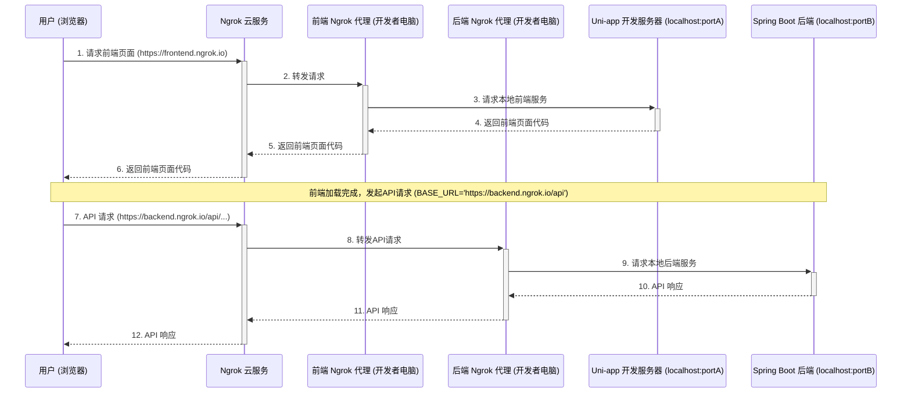
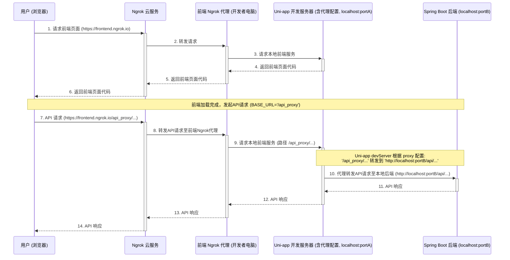

ngrok 是一款强大的工具，可以让你将本地运行的 web 服务暴露到公网上，非常适合用于本地开发调试、向客户演示项目或测试 webhook 等场景。

## 一、下载并安装 ngrok

1.  **访问 ngrok 官网下载页面**：[https://ngrok.com/download](https://ngrok.com/download)
2.  **下载 Windows 版本的 ngrok**
    ![][1]
3.  **解压 ngrok**：将下载的 `ngrok.zip` 文件解压到一个你方便访问的目录，解压后你会得到一个 `ngrok.exe` 文件。
![][2]

## 二、配置 ngrok Authtoken

为了使用 ngrok 的更多功能（例如自定义子域名等，尽管某些高级功能可能需要付费），建议连接到你的 ngrok 账户。

1.  **登录 ngrok 官网**：访问 [https://dashboard.ngrok.com/](https://dashboard.ngrok.com/)。
2.  **获取 Authtoken**：在仪表盘的 "Your Authtoken" 或 "Setup & Installation" 部分，你会找到你的 Authtoken。
    ![][3]
3.  **配置 Authtoken**：
    *   运行**ngrok.exe**
    *   运行以下命令（将 `YOUR_AUTHTOKEN` 替换为你自己的 Authtoken）：
        ```bash
        .\ngrok.exe config add-authtoken YOUR_AUTHTOKEN
        ```
    *   成功后，ngrok 会将 Authtoken 保存到其默认的配置文件中 (通常在 `C:\Users\YourUserName\.ngrok2\ngrok.yml`)。

    **可选：将 ngrok添加到系统环境变量 (PATH)**
    为了在任何目录下都能直接运行 `ngrok` 命令，而不是每次都 `cd` 到其所在目录，你可以将其路径添加到系统环境变量 `PATH` 中。
    1.  在 Windows 搜索中搜索"环境变量"，选择"编辑系统环境变量"。
    2.  在"系统属性"窗口中，点击"系统变量(N)..."按钮。
    3.  在"系统变量"区域找到名为 `Path` 的变量，选中它，然后点击"编辑(E)..."。
    4.  点击"新建(N)"，然后输入 `ngrok.exe` 所在的目录路径 (例如 `D:\tools\ngrok`)。
    5.  一路点击"确定"保存更改。之后新打开的命令行窗口即可直接使用 `ngrok` 命令。
    *   *(截图机会：展示添加环境变量的步骤)*

## 三、启动本地 uniapp 项目

接下来，我们需要一个在本地运行的 web 服务。这里以 uniapp H5 项目为例。

1.  **进入 uniapp 项目目录**：使用命令行工具 (CMD, PowerShell, Git Bash 等) `cd` 到你的 uniapp 项目根目录。
2.  **启动开发服务器**：运行 uniapp 的 H5 开发命令。
    *   如果使用 npm:
        ```bash
        npm run dev:h5
        ```
    *   如果使用 yarn:
        ```bash
        yarn dev:h5
        ```
3.  **记录本地地址和端口**：项目启动后，命令行通常会显示 H5 预览地址，例如 `http://localhost:8080` 或 `http://127.0.0.1:3000`。记下这个端口号，我们稍后会用到。
    ![][4]

## 四、使用 ngrok 暴露本地服务

现在，我们将使用 ngrok 将本地运行的 uniapp 项目暴露到公网上。

1.  **新建域并启动** 
    ![][5]
2.  **启动隧道，运行 ngrok 命令**：
    ![][6]
    ![][7]
3.  **获取公网URL**：ngrok 启动后，会在命令行界面显示一些信息，最重要的就是 `Forwarding` 中的`https://` 开头的 URL，这就是你的公网访问地址。
    ![][8]


## 五、通过公网 URL 访问项目

现在，你或你的朋友、同事、客户等，可以在任何有网络连接的设备上，通过浏览器打开上一步中 ngrok 生成的 `Forwarding` URL (通常建议使用 `https` 的那个)，就能访问到你本地运行的 uniapp 项目了，到这里对于未配置后端的项目来说已经穿透成功了。

![][9]

## 六、后端API项目的穿透问题排查 (uni-app + 后端 API 示例)

当你使用 uni-app 开发前端，并需要连接到一个独立的后端 API 服务（例如 Java Spring Boot, Node.js 等）时，通过 ngrok 暴露前端后，可能会遇到 API 请求失败的问题。本地直接访问 `localhost:UNIAPP_DEV_PORT` (uni-app H5 运行的端口) 时一切正常，但通过 ngrok 生成的公网 URL 访问时，后端接口调用不通。

**常见现象:**

*   浏览器开发者工具的网络(Network)标签页显示 API 请求失败，错误可能是 `net::ERR_CONNECTION_REFUSED`。
*   或者，如果后端没有正确配置CORS，可能会看到跨域相关的错误信息。

**主要原因及解决方案 (针对绝对 `BASE_URL` 配置):**

假设你的 uni-app 项目中，API 请求的基础路径 `BASE_URL` 是一个写死的本地地址，例如：

```javascript
// 在 api/index.js 或类似文件中
const BASE_URL = 'http://localhost:8080/api'; // 你的后端API基础路径
```

1.  **问题核心：`localhost` 指向的是客户端**
    *   当你的同学或同事通过 ngrok 的公网 URL (例如 `https://xxxx.ngrok.io`) 访问你的 uni-app 应用时，应用内的 JavaScript 代码（包括 API 请求）是在他们的浏览器中执行的。
    *   因此，代码中对 `http://localhost:8080/api` 的请求，实际上是尝试连接他们自己电脑上的 `localhost:8080` 服务。如果他们的电脑上没有运行对应的后端服务，这个请求自然会失败。

2.  **解决方案：为后端 API 服务也启动 ngrok**
    *   **步骤1: 确保后端服务正常运行**：首先，确保你的 Spring Boot (或其他) 后端服务正在你的开发机器上的 `localhost:8080` (或你配置的任何端口) 成功运行。
    *   **步骤2: 为后端启动单独的 ngrok 实例**：打开一个新的命令行窗口，`cd` 到 ngrok.exe 所在的目录（或者如果已配置环境变量，直接运行），然后为你的后端服务端口启动 ngrok。如果后端运行在 `8080` 端口：
        ```bash
        ngrok http 8080
        ```
    *   ngrok 会为你的后端服务生成另一个公网 URL，例如 `https://yyyy.ngrok.io`。
    *   **步骤3: (临时) 修改前端的 `BASE_URL`**：回到你的 uni-app 项目代码，在 `api/index.js` (或类似文件) 中，将 `BASE_URL` 临时修改为 ngrok 为后端生成的公网地址：
        ```javascript
        // 临时修改，用于公网演示
        const BASE_URL = 'https://yyyy.ngrok.io/api'; // 注意：这里是后端 ngrok 的地址
        ```
    *   **步骤4: 重新编译 uni-app 项目** (如果需要)，并确保访问前端 ngrok 地址的用户获取到的是更新了 `BASE_URL` 的前端代码。
    *   现在，通过前端 ngrok URL 访问应用时，API 请求就会正确地指向你通过 ngrok 暴露的公网后端服务了。

3.  **后端 CORS 配置**:
    *   非常重要！你的后端服务（如 Spring Boot）必须配置 CORS (跨源资源共享) 策略，以允许来自你的前端 ngrok URL (例如 `https://xxxx.ngrok.io`) 和后端 ngrok URL (`https://yyyy.ngrok.io`，如果请求来源是它) 的请求。否则，即使地址正确，浏览器也可能因为安全策略阻止请求。
    *   在 Spring Boot 中，通常使用 `@CrossOrigin`注解或全局 CORS 配置。

**替代方案 (推荐用于开发和更便捷的共享): 使用代理**

虽然上述方法可行，但每次共享都需要修改 `BASE_URL` 并可能需要重新部署前端，比较繁琐。更推荐的做法是在 uni-app 开发服务器层面设置代理，将特定的 API 请求转发到本地后端。

1.  **前端 `BASE_URL` 使用相对路径**:
    ```javascript
    // api/index.js
    const BASE_URL = '/api_proxy'; // 一个自定义的代理前缀
    // ... 确保请求方法中 url 拼接正确，例如： request({ url: options.url ...}) 变成 request({ url: BASE_URL + options.url ...})
    // 如果 options.url 已经是 /resource/action, 那么拼接后就是 /api_proxy/resource/action
    ```
2.  **配置 `vue.config.js` (uni-app H5 项目根目录)**:
    如果项目根目录下没有 `vue.config.js` 文件，新建一个。
    ```javascript
    // vue.config.js
    module.exports = {
      devServer: {
        proxy: {
          '/api_proxy': { // 匹配前端以 /api_proxy 开头的请求
            target: 'http://localhost:8080', // 你的本地后端服务地址
            changeOrigin: true, // 必须，用于支持跨域
            pathRewrite: {
              '^/api_proxy': '/api' // 将请求路径中的 /api_proxy 替换为 /api (如果后端是以 /api 开头的)
                                    // 例如 /api_proxy/users/list -> http://localhost:8080/api/users/list
            }
          }
        }
      }
    };
    ```
    *修改 `vue.config.js` 后，需要重启 uni-app 开发服务器 (`npm run dev:h5`)。*
3.  **ngrok 暴露 uni-app 开发服务器**: 这种情况下，你只需要像之前一样，用 ngrok 暴露 uni-app H5 运行的端口 (例如 `ngrok http UNIAPP_DEV_PORT`)。uni-app 的开发服务器会自动将 `/api_proxy` 的请求转发到你的本地后端。这样，前端代码中的 `BASE_URL` 无需改动，分享也更方便。

### 交互流程图示

下面通过图示来进一步说明两种主要配置下的工作流程。

**(一) 绝对 `BASE_URL` + 前后端分别使用 Ngrok (推荐用于需要固定公网后端地址的场景)**

这种配置下，前端代码中的 `BASE_URL` 直接指向后端 ngrok 的公网地址。




**解释:**
*   **用户 (自己或他人)**：通过 `https://frontend.ngrok.io` (前端的公网 ngrok 地址) 访问应用。
*   前端应用加载后，其 API 请求直接指向 `https://backend.ngrok.io/api` (后端的公网 ngrok 地址)。
*   这种方式清晰地分离了前端和后端的公网访问点。

**(二) 相对 `BASE_URL` + Uni-app `devServer.proxy` + 前端使用 Ngrok (推荐用于开发调试和便捷分享)**

这种配置下，前端代码中的 `BASE_URL` 是一个相对路径 (如 `/api_proxy`)，由 Uni-app 开发服务器代理到本地后端。



**解释:**
*   **用户 (自己或他人)**：通过 `https://frontend.ngrok.io` 访问应用。
*   前端应用加载后，其 API 请求 (例如 `/api_proxy/users`) 被发送到 `https://frontend.ngrok.io/api_proxy/users`。
*   这个请求到达开发者的 Uni-app 开发服务器后，其内部的代理设置会将此请求转发给实际运行在 `localhost:portB` 的后端服务。
*   这种方式下，只需要为前端启动一个 ngrok 实例，配置相对简单。


通用排查提示:

*   **确认后端服务已启动并监听正确端口**：这是最基本的一步。
*   **直接测试后端接口**：使用 Postman、curl 或直接在浏览器中（如果接口支持GET）访问你的本地后端接口 (例如 `http://localhost:8080/api/some-endpoint`)，确保它能正常工作并返回数据。如果本地都访问不通，ngrok 自然也无法使其工作。

通过以上步骤，应该能解决大部分 ngrok 穿透后 API 请求失败的问题。

## 七、ngrok Web 界面 (本地监控)

ngrok 还提供了一个本地的 Web 界面，用于监控通过 ngrok 隧道的所有 HTTP 请求和响应。默认情况下，这个界面的地址是 `http://127.0.0.1:4040` (可以在 ngrok 启动时的输出信息中找到)。

打开这个地址，你可以查看所有请求的详细信息 (headers等)，检查连接状态，这对于调试非常有用。
![][10]

## 八、停止 ngrok

当你不再需要公网访问时，可以停止 ngrok。

*   回到运行 ngrok 命令的那个命令行窗口。
*   按下 `Ctrl + C` 组合键。
ngrok 会断开连接，公网 URL 将不再可用。你的本地 uniapp 项目仍然在运行（除非你也停止了它）。


## 总结
ngrok 是一个非常实用的内网穿透工具，能够极大地简化本地开发和调试过程中的分享与测试环节。通过本教程，你应该已经掌握了在 Windows 上使用 ngrok 暴露本地 uniapp 项目的基本方法，希望这对你有所帮助。


  [1]: https://static.blog.ybyq.wang/usr/uploads/2025/05/16/2025-05-15T23:09:01.png?x-oss-process=style/shuiyin
  [2]: https://static.blog.ybyq.wang/usr/uploads/2025/05/16/2025-05-15T23:10:27.png?x-oss-process=style/shuiyin
  [3]: https://static.blog.ybyq.wang/usr/uploads/2025/05/16/2025-05-15T23:16:20.png?x-oss-process=style/shuiyin
  [4]: https://static.blog.ybyq.wang/usr/uploads/2025/05/16/2025-05-15T23:23:55.png?x-oss-process=style/shuiyin
  [5]: https://static.blog.ybyq.wang/usr/uploads/2025/05/16/2025-05-15T23:27:34.png?x-oss-process=style/shuiyin
  [6]: https://static.blog.ybyq.wang/usr/uploads/2025/05/16/2025-05-15T23:29:55.png?x-oss-process=style/shuiyin
  [7]: https://static.blog.ybyq.wang/usr/uploads/2025/05/16/2025-05-15T23:33:07.png?x-oss-process=style/shuiyin
  [8]: https://static.blog.ybyq.wang/usr/uploads/2025/05/16/2025-05-15T23:39:51.png?x-oss-process=style/shuiyin
  [9]: https://static.blog.ybyq.wang/usr/uploads/2025/05/16/2025-05-15T23:42:27.png?x-oss-process=style/shuiyin
  [10]: https://static.blog.ybyq.wang/usr/uploads/2025/05/16/2025-05-16T00:28:03.png?x-oss-process=style/shuiyin


  ---

> 作者：xuan
> 个人博客：[https://blog.ybyq.wang](https://blog.ybyq.wang)
> 欢迎访问我的博客，获取更多技术文章和教程。
